# California Wildfire Analysis | Ignition Sources
Author: Jennifer Jaurequi, Long Le, Be Han

# Table of Contents
- [Description](#description)
- [Methodology](#methodology)
- [Results](#results)

# Description
This project analyzes wildfire data from California covering the period from 2020 to 2023. The analysis includes a detailed examination of fire occurrences, categorized by cause and year. Key insights include a notable decrease in fires in 2020, which was consistent with reduced lightning activity and pandemic-related lockdowns. In contrast, 2021 saw a surge in fires, particularly from unknown causes, while lightning activity dropped significantly in 2022. The project visualizes these trends through various charts and plots, providing a comprehensive overview of the factors influencing wildfire frequency and severity over these years.

# Methodology
### Data Pulling
Our team used CalFire API to pull data from the most recent years and some as far back as 2013 to use for our research. We created datasets in Jupyter Notebook to display the fire data. 
### Cleaning and Analyzing
After getting the data from the CalFire API some cleaning were needed to be done to the data. This data contained Alarm dates and Containment dates of the fires and some were formatted incorrectly. We used pandas library and dataframe manipulation to change the formatting to fit our need before continuing to analyzing the data. 

The key components to look for our analysis were the Alarm Dates, Containment Dates, GIS Acres, and the Cause columns of the dataframe. Using the Containment Dates and Alarm Dates we were able to create a separate column called Duration that listed the difference between the two dates to show how long it took to contain each fire. We then created a seperate dataframe to show the average duration, average GIS acres spread, and number of incidents for each cause. These dataframes were created for each year that we analyzed. Then they were exported their own csv files, to be pulled at any time for further analysis. A seperate notebook were then created with all the years merged together into one dataframe to show the overall data for all the years. We also created a dataframe grouping all the man-made causes together and all the natural causes together.

# Results

## 2020-2023 Fires Line Plot
The analysis begins with a scatter plot depicting the number of fires from 2020 to 2023. In 2020, the number of fires was notably lower, which was consistent with the reduced lightning activity recorded that year. The COVID-19 pandemic and associated lockdowns likely contributed to fewer fires, but even natural lightning activity was significantly reduced. In contrast, there was a notable increase in fires in 2021, followed by a significant decrease afterward. Lightning activity dropped considerably in 2022, while arson and vehicle fires saw an increase.

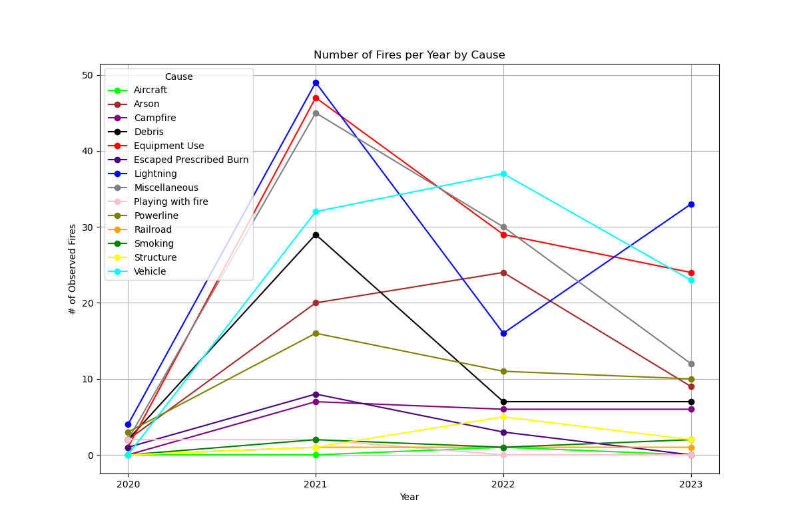

## 2021 Bar Chart
The bar chart illustrates the number of observed fires in 2021 by cause. The highest number of incidents were attributed to unknown causes. Among the known causes, the top five were lightning, equipment use, miscellaneous factors, vehicle-related fires, and debris. Arson ranked just below debris.

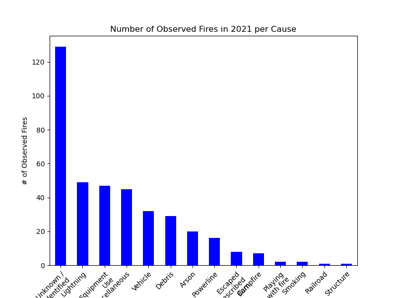

## 2021 Line Plots
The first line plot displayed the number of observed fires per month in 2021, categorized by cause. It was evident that fires of unknown origin constituted a significant portion of the data.

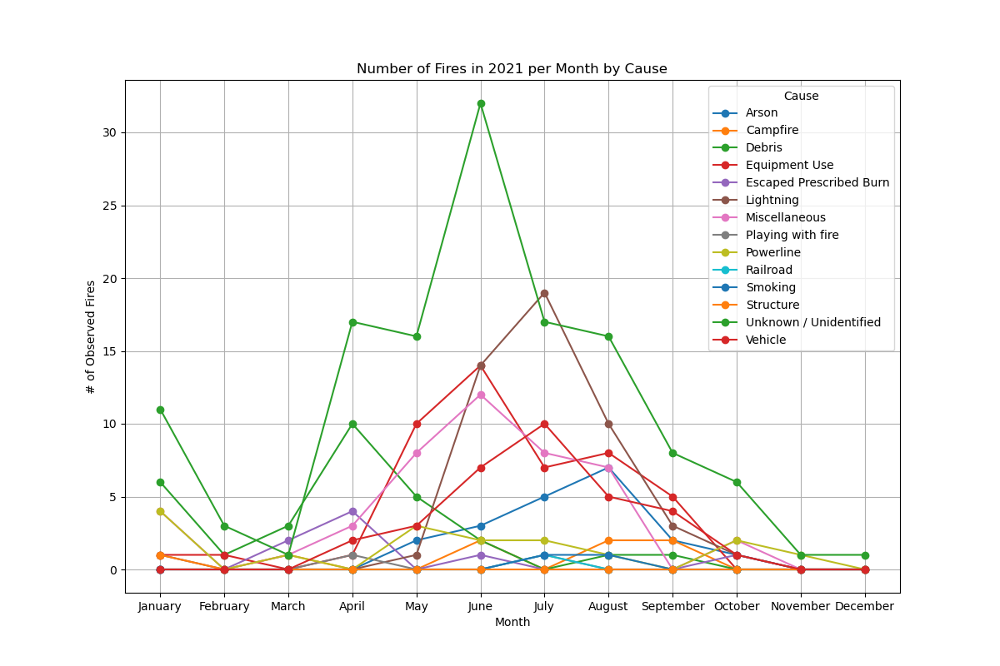

When focusing on known causes, a notable spike in debris-related fires occurred in April, with no other month showing a comparable peak for debis fires. As expected, most other causes of fire increased during the summer months, particularly from May to August, with notable peaks in June and July. Equipment use and miscellaneous causes followed lightning in frequency, aligning with the bar chart data.

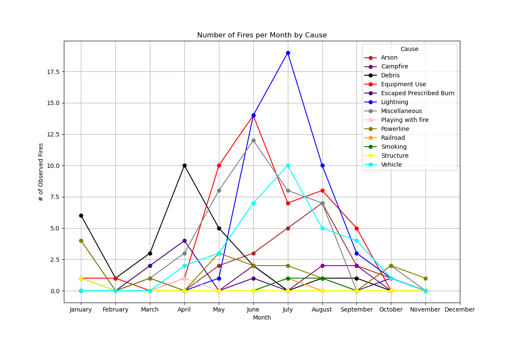

By categorizing causes into three groups—man-made, natural, and unknown—the scatter plot revealed that fires of unknown origin often surpassed those caused by man-made or natural factors. Additionally, there were more fires attributed to man-made causes compared to natural ones.

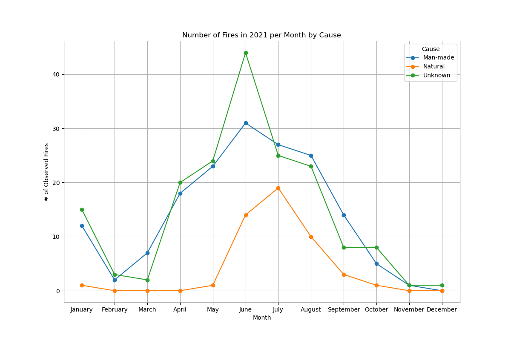

## 2021 Man-Made vs. Natural Pie Charts
The first pie chart highlights that a significant number of fires in 2021 were caused by man-made factors. Conversely, the second pie chart showed that natural causes, primarily lightning, resulted in a greater number of acres burned.

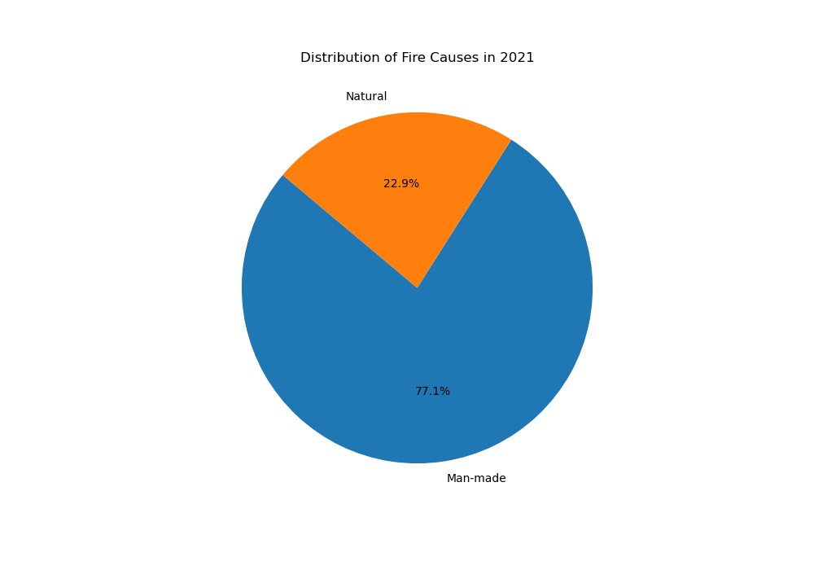

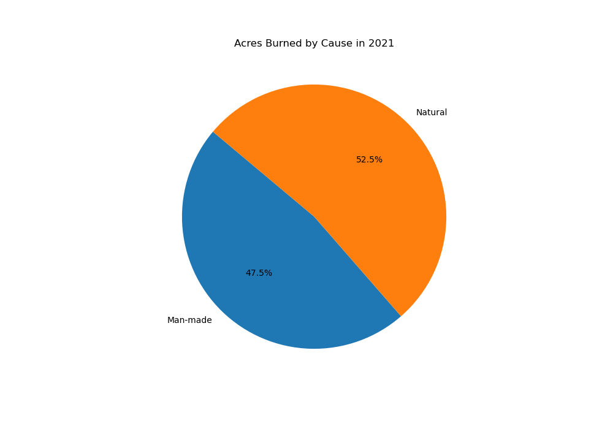

## 2013-2023 Man-Made vs. Natural Pie Charts
The pie charts show that while there were more wildfires started due to man-made causes, that wildfires caused by lightening resulted in greater loss of acreage. This could be due to lightening causing fires in more remote areas with greater green space, and less accessibility for mitigation, while man-made ignition sources are associated with less greenery and greater human infrastructure and access almost by definition. Whether or not this accounts for the discrepency can be explored further by looking at material composition of burn areas and looking at distances from human infrastructure.

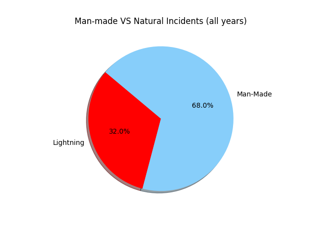!

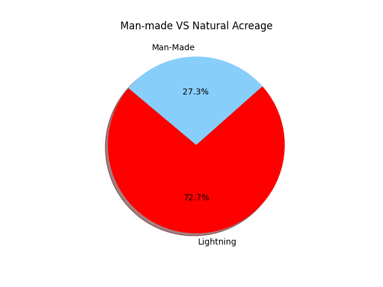!

## 2013-2023 Average Bar Charts
We created barcharts to display the Average Duration for each cause to compare on average how long a fire last for each cause. Similarly barcharts were created for GIS Acres Spread and number of incidents per cause. 

What is noticeable is that fires started by lightening have a significant longer time to conatinmnet, most likely due to the reasons listed above.

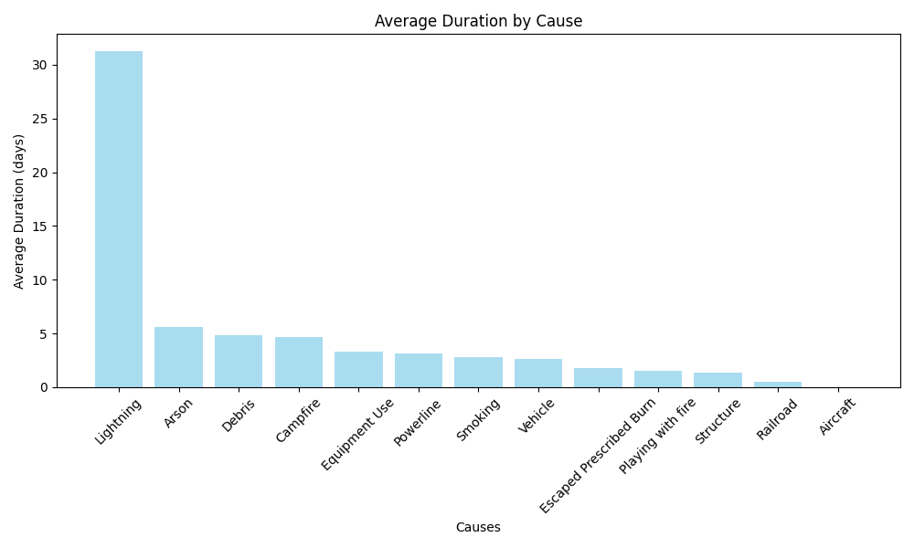!

It is also the single greated cause of fires, however, it is less the the aggregate of all the other incidents that have a human component.

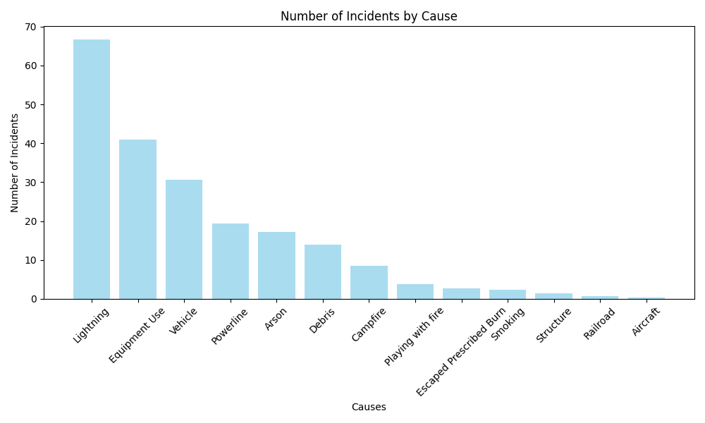!

It is surprising that fires caused by powerlines caused less incidents of fire, that the average acreage burnt due to powerlines are similar to that of lightening. This could be indicative of aging infrastructure, although it may be that the incidents related to pwerlines occured in amore remote areas. However, this is an area where mitigatioins strategies can be designed and implemented.

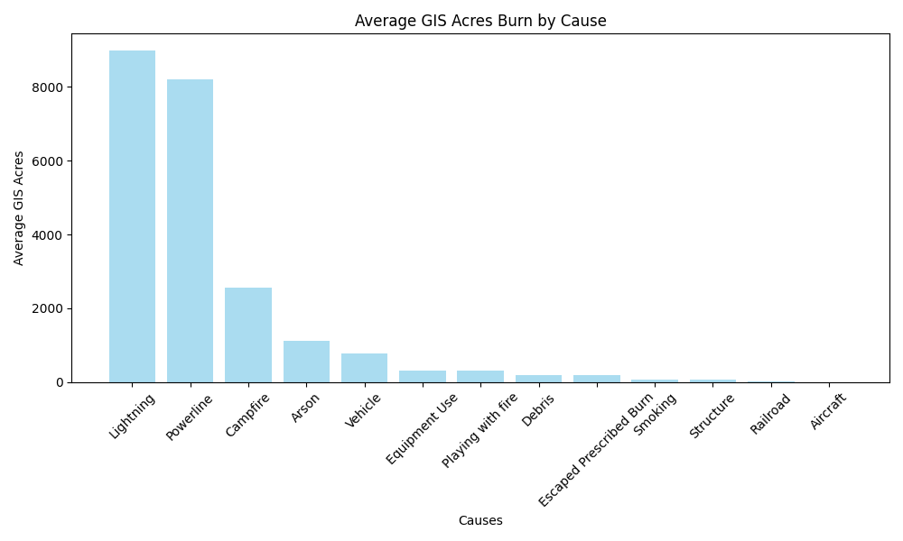!

## 2013-2023 Average Bar Charts

We created boxplots to show the range of the acres spread and duration for each cause as well. Although we had the averages the boxplot showed a better representation of the the data as a whole taking in consideration of the outliers in the data. 

The duration plot indicates that the distribution of duration fits better with a logarithmic scale, and that while the statistical distribution of the data isn't uniform, it indicates that conclusions drawn from analyzing the data is still useful, and that median or mean can be considered depending on use case. 

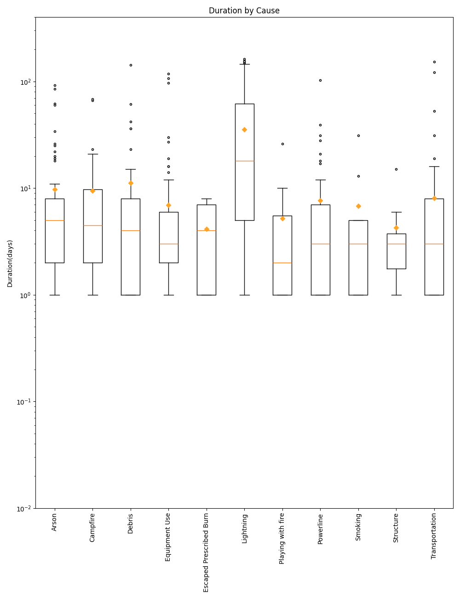

The acreage plot indicates that the distribution of acreage fits better with a logarithmic scale, but there are a lot of statistical outliers suggesting that this particulare dataset is better represented by it's mean than it's median, as there doesn't seem to be a meaningful distribution.

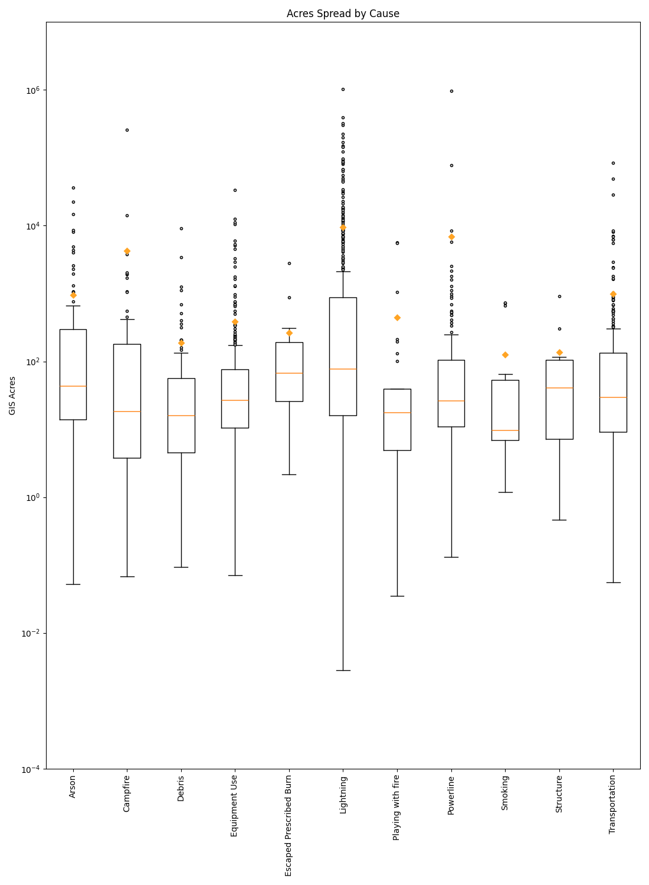

# Conclusions

**2020 Fire Reduction**: In 2020, the number of fires was significantly lower, correlating with reduced lightning activity and the impact of COVID-19 lockdowns, which likely reduced human activities and fire incidents.

**Increase in 2021**: There was a significant increase in the number of fires in 2021. Unknown causes were the most frequent, while known causes like lightning, equipment use, and debris were also notable.

**2022 Fires**: Lightning activity, a major cause of fires, dropped significantly in 2022, contributing to a decrease in overall fire incidents.  In contrast, arson and vehicle-related fires increased.  

**Seasonal Patterns**: Debris fires were particularly high in April.  As expected, fires generally spiked during the summer months (May to August), with notable peaks in June and July. 

**Man-Made vs. Natural Causes**: While man-made causes led to a higher number of fires, natural causes, lightning in particular, resulted in more acres burned.

**Unknown Causes Predominance**: Fires of unknown origin consistently surpassed those attributed to man-made or natural causes in both frequency and impact.

## Future Research
One area for future research is to investigate the patterns associated with unknown fires more thoroughly. Specifically, we aim to explore whether there is a relationship between the time of day and the occurrence of these fires compared to those with known causes. 

Another area for further research is to examine the material composition and proximity to human infrastructure of burn areas to see how that can correlate to our initial study.
